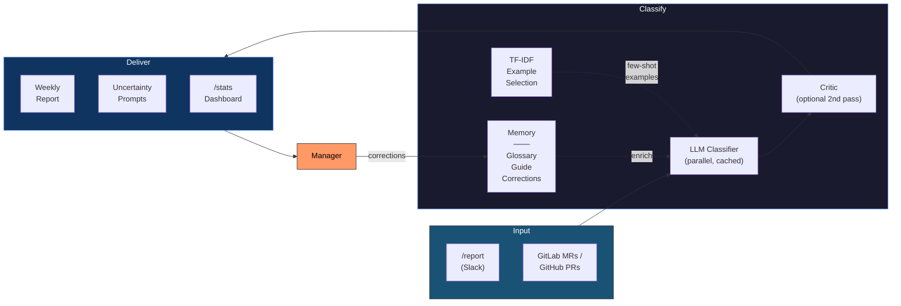

# ReportBot

A Slack bot that helps a development team track weekly work items and generate categorized markdown reports.

Developers report completed work via slash commands. The bot also pulls merged/open GitLab MRs and GitHub PRs (manually or on a cron schedule). An LLM (Anthropic Claude or OpenAI) classifies items into sections derived from the previous report.

> **What started as "can an LLM sort bullet points into categories?"** turned into a self-improving classification system with memory, self-evaluation, and a second LLM that critiques the first one's homework. This project is an experiment in agentic AI patterns — the bot learns from its mistakes, writes its own rules, and occasionally gets things right on the first try. Built mostly by talking to Claude, because why write code yourself when you can argue with an AI about code instead.

## Features

### Commands

- `/report` (or `/rpt`) — Developers report work items via Slack
- `/fetch` — Pull merged and open GitLab MRs and/or GitHub PRs for the current calendar week
- `/generate-report` (or `/gen`) — Generate a team markdown file (or boss `.eml` draft) and upload it to Slack
- `/list` — View this week's items with inline edit/delete actions
- `/check` — Managers: list missing members with inline nudge buttons
- `/retrospect` — Managers: analyze recent corrections and suggest glossary/guide improvements
- `/stats` — Managers: view classification accuracy dashboard and trends
- `/help` — Show all commands and example usage

### Report Generation

- Two report modes: **team** (author per line) and **boss** (authors grouped by category)
- Manager-only permissions for report generation and MR fetching
- **Weekly nudge** — Automatically DMs team members on a configurable day to remind them to report
- **Welcome message** — New channel members receive an intro message explaining how to use the bot

### Agentic AI (Closed-Loop Classification)

The LLM classifier improves itself over time through a feedback loop:

- **Parallel batch classification** — Items are classified concurrently via goroutines (~3x speedup)
- **Prompt caching** — Anthropic system prompts are cached across parallel batches (~40% cost reduction)
- **TF-IDF example selection** — Few-shot examples are selected by relevance from 12 weeks of classification history, replacing blind "first N items"
- **Generator-Critic loop** — Optional second LLM pass reviews all assignments and catches misclassifications before manager review
- **Classification history** — Every LLM decision is persisted with confidence scores for auditability
- **Correction capture** — Manager corrections (via edit modal or uncertainty buttons) are stored and fed back into future prompts
- **Auto-growing glossary** — When the same correction appears 2+ times, a deterministic glossary rule is created automatically
- **Uncertainty sampling** — Low-confidence items are surfaced to the manager with interactive section buttons after report generation
- **Retrospective analysis** — `/retrospect` uses the LLM to find correction patterns and suggest glossary terms or guide updates
- **Accuracy dashboard** — `/stats` shows classification metrics, confidence distribution, most-corrected sections, and weekly trends



See [docs/agentic-features-overview.md](docs/agentic-features-overview.md) for a detailed overview.

## Quick Start

### 1. Create a Slack App

1. Go to [api.slack.com/apps](https://api.slack.com/apps) and create a new app
2. Enable **Socket Mode** — generate an App-Level Token with `connections:write` scope
3. Under **OAuth & Permissions**, add these Bot Token Scopes:
   - `chat:write`
   - `commands`
   - `files:write`
   - `im:write` (for nudge DMs)
   - `users:read` (to resolve full names for managers/team members)
4. Under **Event Subscriptions**, subscribe to these bot events:
   - `member_joined_channel` (sends welcome message to new members)
5. Under **Interactivity & Shortcuts**, toggle **Interactivity** on (required for edit/delete modals in `/list`)
6. Under **Slash Commands**, create these commands:

   | Command | Description |
   |---|---|
   | `/report` | Report a work item |
   | `/rpt` | Alias of `/report` |
   | `/fetch` | Fetch merged and open GitLab MRs and/or GitHub PRs for this week |
   | `/generate-report` | Generate the weekly report (`team`/`boss`, optional `private`) |
   | `/gen` | Alias of `/generate-report` |
   | `/list` | List this week's work items |
   | `/check` | List missing members with nudge buttons |
   | `/retrospect` | Analyze corrections and suggest improvements |
   | `/stats` | View classification accuracy dashboard |
   | `/help` | Show help and usage |

7. Install the app to your workspace

### 2. Configure

Configuration can be provided via **`config.yaml`** file, **environment variables**, or both. Env vars take precedence over YAML values.
The repository `config.yaml` and `llm_glossary.yaml` are committed as examples.
Put environment-specific overrides under `override/` (git-ignored), for example:
`override/config.yaml` and `override/llm_glossary.yaml`.

#### Option A: config.yaml (recommended)

Create `config.yaml` and edit:

```yaml
# Slack
slack_bot_token: "xoxb-..."
slack_app_token: "xapp-..."

# GitLab
gitlab_url: "https://gitlab.example.com"
gitlab_token: "glpat-..."
gitlab_group_id: "my-team"
gitlab_ref_ticket_label: "Jira"   # optional: parse ticket IDs from "Jira:" field in GitLab MR description; empty disables parsing

# LLM
llm_provider: "anthropic"       # "anthropic" or "openai"
llm_batch_size: 50              # optional: items per LLM classification batch
llm_confidence_threshold: 0.70  # optional: route below-threshold to Undetermined
llm_example_count: 20           # optional: prior-report examples included in prompt
llm_example_max_chars: 140      # optional: max chars per example snippet
llm_glossary_path: "./llm_glossary.yaml"    # optional glossary memory file
llm_critic_enabled: false   # optional: enable generator-critic second pass
anthropic_api_key: "sk-ant-..."

# Permissions (Slack user IDs)
manager_slack_ids:
  - "U01ABC123"

# Team members (Slack full names) - used by /check and scheduled nudge
team_members:
  - "Member One"
  - "Member Two"

# Automatic MR/PR fetching (cron expression, empty to disable)
auto_fetch_schedule: "0 9 * * 1-5"  # weekdays at 9am

# Day and time for scheduled nudge (configured timezone)
nudge_day: "Friday"
nudge_time: "10:00"
monday_cutoff_time: "12:00"  # Monday before this time uses previous week

# Timezone for week range and scheduled nudge (IANA format)
timezone: "America/Los_Angeles"

# Team name (used in report header and filename)
team_name: "Example Team"

# Report channel (Slack channel ID for reminders)
report_channel_id: "C01234567"
external_http_timeout_seconds: 90  # optional: timeout for GitLab/GitHub/LLM HTTP calls

```

Set `CONFIG_PATH` env var to load from a different path (default: `./config.yaml`).

#### Option B: Environment Variables

```bash
export SLACK_BOT_TOKEN=xoxb-...
export SLACK_APP_TOKEN=xapp-...
export GITLAB_URL=https://gitlab.example.com
export GITLAB_TOKEN=glpat-...
export GITLAB_GROUP_ID=my-team
export GITLAB_REF_TICKET_LABEL=Jira            # Optional: field label used for GitLab MR ticket parsing
export LLM_PROVIDER=anthropic
export ANTHROPIC_API_KEY=sk-ant-...
export LLM_BATCH_SIZE=50
export LLM_CONFIDENCE_THRESHOLD=0.70
export LLM_EXAMPLE_COUNT=20
export LLM_EXAMPLE_MAX_CHARS=140
export LLM_GLOSSARY_PATH=./llm_glossary.yaml
export LLM_CRITIC_ENABLED=true                  # Optional: enable generator-critic loop
export MANAGER_SLACK_IDS="U01ABC123,U02DEF456"  # Comma-separated Slack user IDs
export REPORT_CHANNEL_ID=C01234567
export EXTERNAL_HTTP_TIMEOUT_SECONDS=90          # Optional: timeout for external API HTTP calls
export AUTO_FETCH_SCHEDULE="0 9 * * 1-5"        # Optional: cron schedule for auto-fetch
export MONDAY_CUTOFF_TIME=12:00
export TIMEZONE=America/Los_Angeles
```

Note: Category/subcategory headings are sourced from the previous report in `report_output_dir`.

#### LLM Provider Defaults

| Provider | Default Model |
|---|---|
| `anthropic` | `claude-sonnet-4-5-20250929` |
| `openai` | `gpt-5-mini` |

Set `llm_model` in YAML or `LLM_MODEL` env var to override.
Set `llm_batch_size` / `LLM_BATCH_SIZE`, `llm_confidence_threshold` / `LLM_CONFIDENCE_THRESHOLD`, and `llm_example_count` / `llm_example_max_chars` to tune throughput, confidence gating, and prompt context size.
Set `llm_glossary_path` / `LLM_GLOSSARY_PATH` to apply glossary memory rules (see `llm_glossary.yaml`).
Set `llm_critic_enabled` / `LLM_CRITIC_ENABLED` to enable a second LLM pass that reviews classifications for errors.
Set `external_http_timeout_seconds` / `EXTERNAL_HTTP_TIMEOUT_SECONDS` to tune timeout limits for GitLab/GitHub/LLM API requests.

Glossary example (`llm_glossary.yaml`):

```yaml
terms:
  - phrase: "user pending"
    section: "Cluster Manager"
  - phrase: "database backup"
    section: "Top Focus > HA Log Sync Enhancement"

status_hints:
  - phrase: "in qa"
    status: "in testing"
  - phrase: "qa passed"
    status: "done"
```

### 3. Build & Run

```bash
# Build (requires CGO for SQLite)
CGO_ENABLED=1 go build -o reportbot ./cmd/reportbot

# Run
./reportbot
```

### 4. Docker

```bash
docker build -t reportbot .
```

#### Option A: With config.yaml (recommended)

```bash
docker run -d --name reportbot \
  -v /path/to/config.yaml:/app/config.yaml:ro \
  -v /path/to/llm_glossary.yaml:/app/llm_glossary.yaml:ro \
  -v reportbot-data:/app/data \
  -v reports:/app/reports \
  reportbot
```

#### Option B: With environment variables

```bash
docker run -d --name reportbot \
  -e SLACK_BOT_TOKEN=xoxb-... \
  -e SLACK_APP_TOKEN=xapp-... \
  -e GITLAB_URL=https://gitlab.example.com \
  -e GITLAB_TOKEN=glpat-... \
  -e GITLAB_GROUP_ID=my-team \
  -e LLM_PROVIDER=anthropic \
  -e ANTHROPIC_API_KEY=sk-ant-... \
  -e MANAGER="Member One,Member Two" \
  -e REPORT_CHANNEL_ID=C01234567 \
  -e MONDAY_CUTOFF_TIME=12:00 \
  -e TIMEZONE=America/Los_Angeles \
  -v reportbot-data:/app/data \
  -v reports:/app/reports \
  reportbot
```

The volume persists the SQLite database and generated reports across restarts.

## Usage

### Reporting Work Items

Any developer can report items:

```
/report Add pagination to user list API (done)
/rpt Migrate auth service to Redis session store (in progress)
/report Fix flaky integration tests in CI (in testing)
```

Managers can report on behalf of a team member:

```
/report {Member One} Research for agentic AI (in progress)
```

Delegated names support fuzzy matching against `team_members` (for example `{Member}` -> `Member Full Name`).

Status is auto-extracted from the trailing parenthetical. Defaults to `done` if omitted.

### Fetching MRs/PRs

Manager only. Pulls all merged and open GitLab MRs and/or GitHub PRs for the current calendar week (Monday–Sunday):

```
/fetch
```

Duplicates are skipped automatically based on MR/PR URL. Non-team authors (not in `team_members`) are filtered out.

**Automatic fetching**: Set `auto_fetch_schedule` to a cron expression and MRs/PRs will be imported on a schedule, with a summary posted to `report_channel_id`. Examples:

```yaml
auto_fetch_schedule: "0 9 * * *"     # daily at 9am
auto_fetch_schedule: "0 9 * * 1-5"   # weekdays at 9am
auto_fetch_schedule: "0 9 * * 5"     # Fridays at 9am
```

### Generating Reports

Manager only. Two modes:

```
/generate-report team            # Generate team markdown (.md) and upload to channel (default)
/generate-report boss            # Generate boss email draft (.eml) and upload to channel (default)
/generate-report boss private    # Send generated boss report to your DM
/gen private                     # Generate team report and send to your DM
/gen team                # Alias of /generate-report team
```

**Team mode** output:

```markdown
#### Backend

- **Member One** - Add pagination to user list API (done)
- **Member Two** - Optimize database query for dashboard metrics (done)
```

**Boss mode** output:

```markdown
#### Backend (Member One, Member Two)

- Add pagination to user list API (done)
- Optimize database query for dashboard metrics (done)
```

Generated files are saved to `REPORT_OUTPUT_DIR` and uploaded to Slack as files.
Filename date suffix uses Friday of the reporting week, e.g. `TEAMX_20260220.md`.

### Listing Items

Anyone can view this week's items:

```
/list
```

`/list` now includes inline actions:
- Members can edit/delete only their own items.
- Managers can edit/delete all items.
- Delete uses a confirmation modal.
- Edit opens a modal with a text field for the description and a dropdown for the status.

### Nudge Reminders

**Scheduled**: Every week on `nudge_day` (default Friday) at `nudge_time` (default 10:00 AM local), the bot DMs each user in `team_members` reminding them to report. To disable, leave `team_members` empty.

**On-demand**: `/check` lists team members who haven't reported this week, with a "Nudge" button next to each member and a "Nudge All" button at the bottom. Clicking opens a confirmation before sending the DM.

On Monday before `monday_cutoff_time` (default `12:00`) in configured `timezone`, report commands use the previous calendar week.

Accepts any day name: `Monday`, `Tuesday`, ..., `Sunday`.

Requires the `im:write` bot token scope in your Slack app.

## Permissions

Manager commands (`/fetch`, `/generate-report`, `/check`, `/retrospect`, `/stats`) are restricted to Slack user IDs listed in `manager_slack_ids`.

## Report Structure

Report sections and sub-sections are sourced from the previous generated team report. Their order is preserved exactly.

`/generate-report team` writes the team-mode markdown report to `report_output_dir`.

`/generate-report boss` is derived from the generated team report for the same week and posted to Slack without writing a separate boss file.

## Project Structure

```
reportbot/
  cmd/reportbot/main.go     Entry point
  internal/app/             Bootstrap/wiring
  internal/config/          YAML + env var loading, validation, permission checks
  internal/domain/          Core types and calendar/week helpers
  internal/storage/sqlite/  SQLite schema and CRUD
  internal/httpx/           Shared external HTTP client/timeout config
  internal/integrations/slack/   Socket Mode bot, slash commands, member resolution helpers
  internal/integrations/github/  GitHub Search API client for merged/open PRs
  internal/integrations/gitlab/  GitLab API client for merged/open MRs
  internal/integrations/llm/     LLM integration, TF-IDF examples, glossary helpers
  internal/report/          Report template parsing, merge pipeline, markdown/EML rendering
  internal/fetch/           Reusable fetch-import logic and cron auto-fetch scheduler
  internal/nudge/           Scheduled and on-demand nudge DM sender
  Dockerfile           Multi-stage Docker build
  docs/                Architecture diagrams and feature documentation
```

## CI Coverage Visualization

Code coverage is published automatically by GitHub Actions workflow:
`/.github/workflows/ci-coverage.yml`

- On every PR and push to `main`, CI runs `go test ./...` with coverage.
- The run summary includes total and per-function coverage.
- A downloadable artifact is uploaded for each run:
  - `coverage.out`
  - `coverage.txt`
  - `coverage.html` (line-level visualization)

Optional external dashboard:
- Set repository secret `CODECOV_TOKEN` to enable automatic upload to Codecov.
