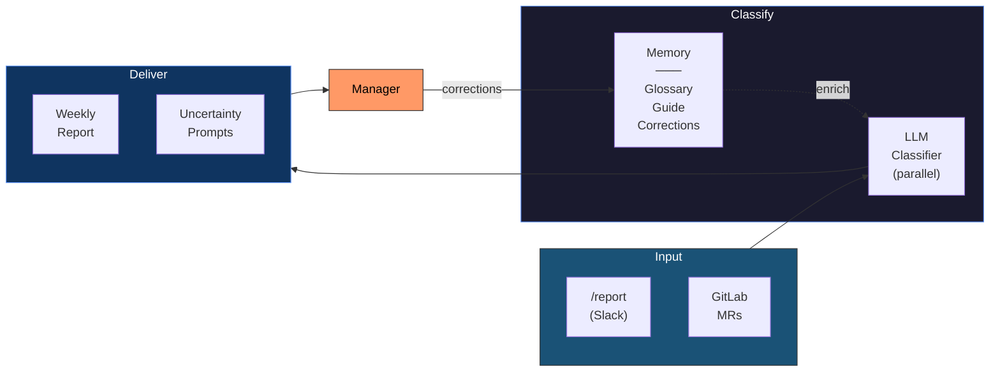

# ReportBot

A Slack bot that helps a development team track weekly work items and generate categorized markdown reports.

Developers report completed work via slash commands. The bot also pulls merged/open GitLab merge requests automatically. An LLM (Anthropic Claude or OpenAI) classifies items into sections derived from the previous report.

## Features

### Commands

- `/report` (or `/rpt`) — Developers report work items via Slack
- `/fetch-mrs` — Pull merged and open GitLab MRs for the current calendar week
- `/generate-report` (or `/gen`) — Generate a team markdown file (or boss `.eml` draft) and upload it to Slack
- `/list` — View this week's items with inline edit/delete actions
- `/check` — Managers: list team members who have not reported this week
- `/nudge [@name]` — Managers: send reminder DMs (missing members by default)
- `/retrospective` — Managers: analyze recent corrections and suggest glossary/guide improvements
- `/help` — Show all commands and example usage

### Report Generation

- Two report modes: **team** (author per line) and **boss** (authors grouped by category)
- Manager-only permissions for report generation and MR fetching
- **Weekly nudge** — Automatically DMs team members on a configurable day to remind them to report
- **Welcome message** — New channel members receive an intro message explaining how to use the bot

### Agentic AI (Closed-Loop Classification)

The LLM classifier improves itself over time through a feedback loop:

- **Parallel batch classification** — Items are classified concurrently via goroutines (~3x speedup)
- **Classification history** — Every LLM decision is persisted with confidence scores for auditability
- **Correction capture** — Manager corrections (via edit modal or uncertainty buttons) are stored and fed back into future prompts
- **Auto-growing glossary** — When the same correction appears 2+ times, a deterministic glossary rule is created automatically
- **Uncertainty sampling** — Low-confidence items are surfaced to the manager with interactive section buttons after report generation
- **Retrospective analysis** — `/retrospective` uses the LLM to find correction patterns and suggest glossary terms or guide updates



See [docs/agentic-features-overview.md](docs/agentic-features-overview.md) for a detailed overview.

## Quick Start

### 1. Create a Slack App

1. Go to [api.slack.com/apps](https://api.slack.com/apps) and create a new app
2. Enable **Socket Mode** — generate an App-Level Token with `connections:write` scope
3. Under **OAuth & Permissions**, add these Bot Token Scopes:
   - `chat:write`
   - `commands`
   - `files:write`
   - `im:write` (for Friday nudge DMs)
   - `users:read` (to resolve full names for managers/team members)
4. Under **Event Subscriptions**, subscribe to these bot events:
   - `member_joined_channel` (sends welcome message to new members)
5. Under **Interactivity & Shortcuts**, toggle **Interactivity** on (required for edit/delete modals in `/list`)
6. Under **Slash Commands**, create these commands:

   | Command | Description |
   |---|---|
   | `/report` | Report a work item |
   | `/rpt` | Alias of `/report` |
   | `/fetch-mrs` | Fetch merged and open GitLab MRs for this week |
   | `/generate-report` | Generate the weekly report |
   | `/gen` | Alias of `/generate-report` |
   | `/list` | List this week's work items |
   | `/check` | List team members missing reports |
   | `/nudge` | Send reminder DMs |
   | `/retrospective` | Analyze corrections and suggest improvements |
   | `/help` | Show help and usage |

7. Install the app to your workspace

### 2. Configure

Configuration can be provided via **`config.yaml`** file, **environment variables**, or both. Env vars take precedence over YAML values.
The repository `config.yaml` and `llm_glossary.yaml` are committed as examples.
Put environment-specific overrides under `override/` (git-ignored), for example:
`override/config.yaml` and `override/llm_glossary.yaml`.

#### Option A: config.yaml (recommended)

Create `config.yaml` and edit:

```yaml
# Slack
slack_bot_token: "xoxb-..."
slack_app_token: "xapp-..."

# GitLab
gitlab_url: "https://gitlab.example.com"
gitlab_token: "glpat-..."
gitlab_group_id: "my-team"

# LLM
llm_provider: "anthropic"       # "anthropic" or "openai"
llm_batch_size: 50              # optional: items per LLM classification batch
llm_confidence_threshold: 0.70  # optional: route below-threshold to Undetermined
llm_example_count: 20           # optional: prior-report examples included in prompt
llm_example_max_chars: 140      # optional: max chars per example snippet
llm_glossary_path: "./llm_glossary.yaml"    # optional glossary memory file
anthropic_api_key: "sk-ant-..."

# Permissions (Slack full names)
manager:
  - "Member One"

# Team members (Slack full names) - receive nudge reminders
team_members:
  - "Member One"
  - "Member Two"

# Day and time to send nudge (configured timezone)
nudge_day: "Friday"
nudge_time: "10:00"
monday_cutoff_time: "12:00"  # Monday before this time uses previous week

# Timezone for week range and nudge scheduling (IANA format)
timezone: "America/Los_Angeles"

# Team name (used in report header and filename)
team_name: "Example Team"

# Report channel (Slack channel ID for reminders)
report_channel_id: "C01234567"

```

Set `CONFIG_PATH` env var to load from a different path (default: `./config.yaml`).

#### Option B: Environment Variables

```bash
export SLACK_BOT_TOKEN=xoxb-...
export SLACK_APP_TOKEN=xapp-...
export GITLAB_URL=https://gitlab.example.com
export GITLAB_TOKEN=glpat-...
export GITLAB_GROUP_ID=my-team
export LLM_PROVIDER=anthropic
export ANTHROPIC_API_KEY=sk-ant-...
export LLM_BATCH_SIZE=50
export LLM_CONFIDENCE_THRESHOLD=0.70
export LLM_EXAMPLE_COUNT=20
export LLM_EXAMPLE_MAX_CHARS=140
export LLM_GLOSSARY_PATH=./llm_glossary.yaml
export MANAGER="Member One,Member Two"   # Comma-separated Slack full names
export REPORT_CHANNEL_ID=C01234567
export MONDAY_CUTOFF_TIME=12:00
export TIMEZONE=America/Los_Angeles
```

Note: Category/subcategory headings are sourced from the previous report in `report_output_dir`.

#### LLM Provider Defaults

| Provider | Default Model |
|---|---|
| `anthropic` | `claude-sonnet-4-5-20250929` |
| `openai` | `gpt-4o` |

Set `llm_model` in YAML or `LLM_MODEL` env var to override.
Set `llm_batch_size` / `LLM_BATCH_SIZE`, `llm_confidence_threshold` / `LLM_CONFIDENCE_THRESHOLD`, and `llm_example_count` / `llm_example_max_chars` to tune throughput, confidence gating, and prompt context size.
Set `llm_glossary_path` / `LLM_GLOSSARY_PATH` to apply glossary memory rules (see `llm_glossary.yaml`).

Glossary example (`llm_glossary.yaml`):

```yaml
terms:
  - phrase: "adom pending"
    section: "Cluster Manager"
  - phrase: "kudu backup"
    section: "Top Focus > HA Log Sync Enhancement"

status_hints:
  - phrase: "in qa"
    status: "in testing"
  - phrase: "qa passed"
    status: "done"
```

### 3. Build & Run

```bash
# Build (requires CGO for SQLite)
CGO_ENABLED=1 go build -o reportbot .

# Run
./reportbot
```

### 4. Docker

```bash
docker build -t reportbot .
```

#### Option A: With config.yaml (recommended)

```bash
docker run -d --name reportbot \
  -v /path/to/config.yaml:/app/config.yaml:ro \
  -v /path/to/llm_glossary.yaml:/app/llm_glossary.yaml:ro \
  -v reportbot-data:/app/data \
  -v reports:/app/reports \
  reportbot
```

#### Option B: With environment variables

```bash
docker run -d --name reportbot \
  -e SLACK_BOT_TOKEN=xoxb-... \
  -e SLACK_APP_TOKEN=xapp-... \
  -e GITLAB_URL=https://gitlab.example.com \
  -e GITLAB_TOKEN=glpat-... \
  -e GITLAB_GROUP_ID=my-team \
  -e LLM_PROVIDER=anthropic \
  -e ANTHROPIC_API_KEY=sk-ant-... \
  -e MANAGER="Member One,Member Two" \
  -e REPORT_CHANNEL_ID=C01234567 \
  -e MONDAY_CUTOFF_TIME=12:00 \
  -e TIMEZONE=America/Los_Angeles \
  -v reportbot-data:/app/data \
  -v reports:/app/reports \
  reportbot
```

The volume persists the SQLite database and generated reports across restarts.

## Usage

### Reporting Work Items

Any developer can report items:

```
/report Add pagination to user list API (done)
/rpt Migrate auth service to Redis session store (in progress)
/report Fix flaky integration tests in CI (in testing)
```

Managers can report on behalf of a team member:

```
/report {Member One} Research for agentic AI (in progress)
```

Delegated names support fuzzy matching against `team_members` (for example `{Member}` -> `Member Full Name`).

Status is auto-extracted from the trailing parenthetical. Defaults to `done` if omitted.

### Fetching GitLab Merge Requests

Manager only. Pulls all merged MRs for the current calendar week (Monday–Sunday):

```
/fetch-mrs
```

Duplicates are skipped automatically based on MR URL.

### Generating Reports

Manager only. Two modes:

```
/generate-report team    # Generate team markdown (.md) and upload file to Slack (default)
/generate-report boss    # Generate boss email draft (.eml) and upload file to Slack
/gen team                # Alias of /generate-report team
```

**Team mode** output:

```markdown
#### Backend

- **Member One** - Add pagination to user list API (done)
- **Member Two** - Optimize database query for dashboard metrics (done)
```

**Boss mode** output:

```markdown
#### Backend (Member One, Member Two)

- Add pagination to user list API (done)
- Optimize database query for dashboard metrics (done)
```

Generated files are saved to `REPORT_OUTPUT_DIR` and uploaded to the Slack channel as files.

### Listing Items

Anyone can view this week's items:

```
/list
```

`/list` now includes inline actions:
- Members can edit/delete only their own items.
- Managers can edit/delete all items.
- Delete uses a confirmation modal.
- Edit opens a modal with a text field for the description and a dropdown for the status.

### Weekly Nudge

Every week on `nudge_day` (default Friday) at `nudge_time` (default 10:00 AM local), the bot DMs each user in `team_members` reminding them to report. To disable, leave `team_members` empty.

On Monday before `monday_cutoff_time` (default `12:00`) in configured `timezone`, report commands use the previous calendar week.

Accepts any day name: `Monday`, `Tuesday`, ..., `Sunday`.

Requires the `im:write` bot token scope in your Slack app.

## Permissions

Manager commands (`/fetch-mrs`, `/generate-report`, `/check`, `/nudge`, `/retrospective`) are restricted to Slack full names listed in `manager`.

## Report Structure

Report sections and sub-sections are sourced from the previous generated team report. Their order is preserved exactly.

`/generate-report team` writes the team-mode markdown report to `report_output_dir`.

`/generate-report boss` is derived from the generated team report for the same week and posted to Slack without writing a separate boss file.

## Project Structure

```
reportbot/
  main.go              Entry point
  config.go            YAML + env var loading, permission check
  models.go            WorkItem, GitLabMR types, calendar week helper
  db.go                SQLite schema and CRUD (work_items, classification_history, corrections)
  llm.go               LLM integration (Anthropic + OpenAI), parallel batch classification, retrospective analysis
  glossary.go          Glossary loading, auto-growth from corrections
  gitlab.go            GitLab API client for fetching merged MRs
  report.go            Markdown/EML report file generation
  report_builder.go    Template parsing, LLM classification pipeline, merge logic
  slack.go             Slack Socket Mode bot, slash commands, correction capture, uncertainty sampling
  nudge.go             Weekly reminder scheduler and DM sender
  Dockerfile           Multi-stage Docker build
  docs/                Architecture diagrams and feature documentation
```
