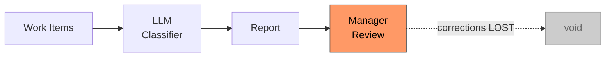
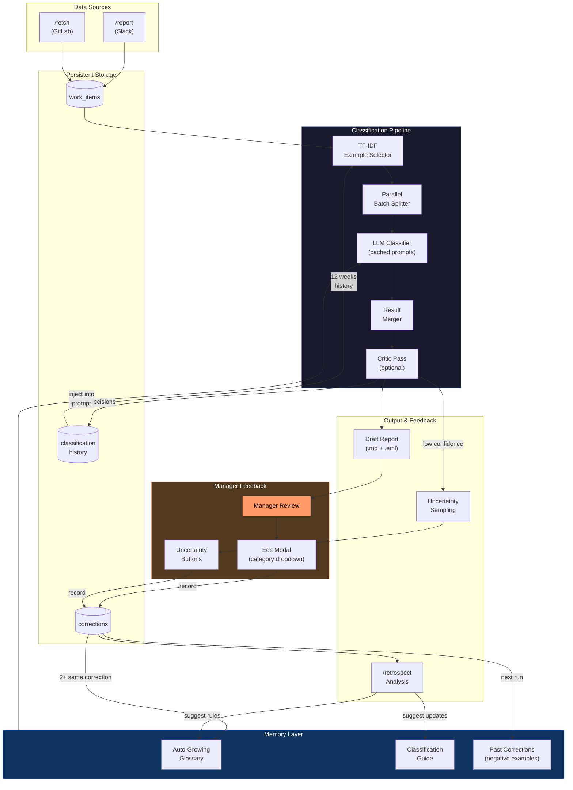
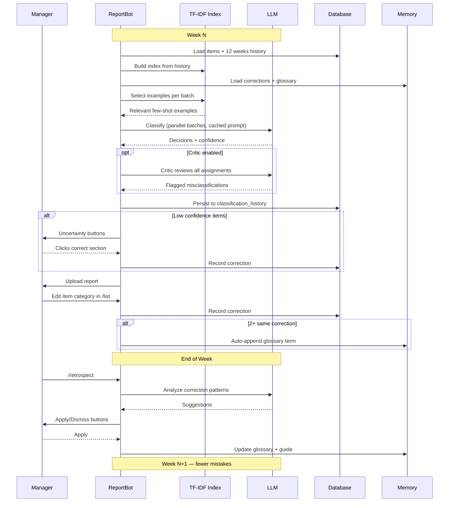
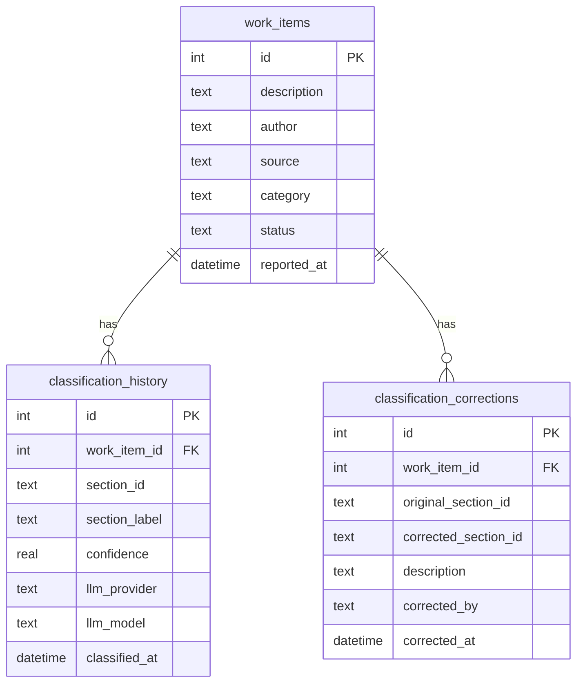
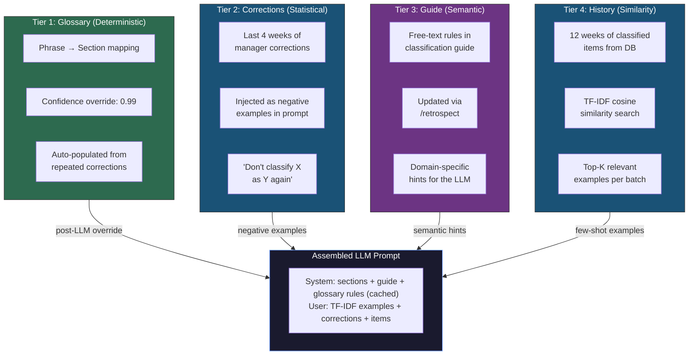

# ReportBot: Closed-Loop Agentic Classification

## The Problem

ReportBot classifies 50-100+ work items per week into report sections using an LLM. The original system was **open-loop** — manager corrections to the generated report were lost, and the LLM repeated the same mistakes every week.



## The Solution: Closed-Loop Feedback

We added a **self-improving feedback loop** where every manager correction trains the next generation run. The system gets smarter each week — without any model fine-tuning.



---

## Key Features

### 1. Parallel Batch Classification

LLM calls are the bottleneck. We split items into batches and classify them **concurrently** via goroutines with `sync.WaitGroup`.

- Each goroutine writes to its own index in a pre-allocated results slice (no mutex)
- All inputs (glossary, options, corrections) are read-only — safe for concurrent access
- ~3x speedup for teams with 50+ items per week

```
Before:  [Batch 1: 800ms] [Batch 2: 750ms] [Batch 3: 820ms] = 2,370ms
After:   [Batch 1: 800ms]                                     =   820ms
         [Batch 2: 750ms]
         [Batch 3: 820ms]
```

### 1a. Prompt Caching

Anthropic system prompts are marked with `CacheControl: ephemeral`. Since all parallel batches share the same system prompt (sections, rules, glossary, corrections), only the first batch pays full input token cost. Subsequent batches hit the cache.

- Tracked via `CacheCreationInputTokens` and `CacheReadInputTokens` in `LLMUsage`
- ~40% reduction in input token costs for multi-batch runs
- OpenAI path is unchanged (no cache control API)

### 1b. TF-IDF Example Selection

Instead of using the first N items from the previous report as few-shot examples, we select the most relevant historical items via TF-IDF cosine similarity.

- `internal/integrations/llm/llm_examples.go` implements a pure Go TF-IDF index (no external deps)
- Up to 500 classified items from the last 12 weeks (confidence >= 0.70) are loaded from `classification_history`
- For each batch, `topKForBatch` finds the union of per-query top-K results, deduplicated
- Falls back to existing-item examples when no history is available
- Pure in-memory computation — zero additional LLM calls

### 1c. Generator-Critic Loop

An optional second LLM pass reviews all classification assignments after batches are merged:

- Enabled via `llm_critic_enabled: true` in config
- The critic sees the full assignment list (all items + their assigned sections) in a single call
- Returns only items it believes are misclassified, with a suggested alternative section
- Valid suggestions are applied; invalid section IDs are ignored
- Non-fatal: if the critic call fails, original assignments are preserved
- Token usage is tracked and logged alongside the main classification

### 2. Classification History

Every LLM decision is persisted to a `classification_history` table with full context:

| Field | Purpose |
|-------|---------|
| `section_id` / `section_label` | What the LLM chose |
| `confidence` | How sure it was (0-1) |
| `normalized_status` | done / in progress / in testing |
| `duplicate_of` | Cross-item dedup reference |
| `llm_provider` / `llm_model` | Reproducibility |

This enables accuracy tracking over time and powers the correction system.

### 3. Correction Capture

Three correction sources feed into a single `classification_corrections` table:

| Source | Trigger | UX |
|--------|---------|-----|
| **Edit Modal** | Manager changes category in `/list` | Dropdown with all report sections |
| **Uncertainty Buttons** | Manager clicks correct section | Inline Slack buttons |
| **Retrospective** | LLM suggests pattern fixes | Apply/Dismiss buttons |

Each correction records: original section, corrected section, item description, who corrected, when.

### 4. Corrections in LLM Prompts

Past corrections (last 4 weeks, up to 20) are injected into the **user prompt** as negative examples:

```
Past corrections (learn from these — avoid repeating these mistakes):
- "Fix TimescaleDB lag" was classified as S1_2 (Support), corrected to S1_3 (Query Service)
- "Tenant pending check" was classified as S0_0 (Infrastructure), corrected to S1_0 (Query Service)
```

The system prompt also gets a one-liner: *"A 'Past corrections' section shows previous misclassifications. Avoid repeating them."*

Result: the LLM avoids repeating known mistakes without any fine-tuning.

### 5. Auto-Growing Glossary

When the **same correction appears 2+ times**, the system automatically appends a term to the glossary YAML:

```
Correction: "tenant pending" → Query Service  (1st time: recorded)
Correction: "tenant pending" → Query Service  (2nd time: auto-glossary triggered)

# glossary.yaml gets:
terms:
  - phrase: "tenant pending"
    section: "Query Service"
```

Glossary terms override LLM decisions with 0.99 confidence — deterministic, zero-latency.

### 6. Uncertainty Sampling

After report generation, items with confidence between 0 and the threshold (default 0.70) get sent to the manager as ephemeral Slack messages with interactive buttons:

```
┌─────────────────────────────────────────────────┐
│ Uncertain classification (45% confidence)       │
│ Item ID: 142                                    │
│ Best guess: Query Service                       │
│                                                 │
│ [Infrastructure] [Query Service] [Support] [Other...] │
└─────────────────────────────────────────────────┘
```

One tap records a correction, updates the item, and feeds the feedback loop. Capped at 10 items to avoid notification fatigue.

### 7. `/retrospect` Command

Manager-only command that loads all corrections from the last 4 weeks and sends them to the LLM for pattern analysis:

```
/retrospect
→ "Analyzing 23 corrections from the last 4 weeks..."
→ Suggestion 1: "TimescaleDB items always go to Query Service"
   Action: Add glossary term "timescaledb" → S1_0
   [Apply] [Dismiss]
→ Suggestion 2: "Support tickets with [ticket] prefix..."
   Action: Add guide rule
   [Apply] [Dismiss]
```

- Max 5 suggestions, only patterns appearing 2+ times
- "Apply" writes directly to glossary YAML or classification guide
- "Dismiss" is a no-op (the correction data is still retained)

---

## The Feedback Cycle



---

## Database Schema



---

## Memory Tiers



---

## What's Next (Deferred)

| Feature | Description | Impact |
|---------|-------------|--------|
| **Structured Output** | Use `anthropic.Tool` for critic response schema | Eliminates JSON parse failures |
| **Structured Logging** | Replace `log.Printf` with `slog` + duration tracking | Observability for LLM call latency |
| **Semantic Embeddings (RAG)** | Replace TF-IDF with vector embeddings for higher-quality example selection | Better cold-start for new item types |
| **ReAct Agent** | Turn classifier into an agent that queries GitLab, past reports, team context before classifying | Context-aware classification |
