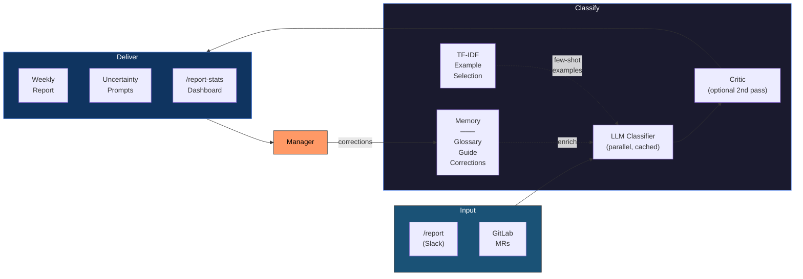

# ReportBot: Agentic AI Features Overview

## What Is ReportBot?

ReportBot is a Slack bot that collects work items from developers (via `/report` commands and GitLab MR imports) and generates structured weekly markdown reports. An LLM classifies each item into the correct report section automatically.

## The Problem We Solved

The LLM classifier was **open-loop** — it made decisions, but never learned from mistakes. Every week, managers manually corrected the same misclassifications. Those corrections were lost the moment the report was finalized.

| Before | After |
|--------|-------|
| LLM repeats same mistakes weekly | LLM learns from every correction |
| Manager fixes are lost | Corrections stored permanently |
| Single-threaded, slow for large teams | Parallel classification (~3x faster) |
| Random few-shot examples | TF-IDF relevance-based example selection |
| Single-pass classification | Optional generator-critic loop catches errors |
| Full-price repeated system prompts | Prompt caching (~40% cost reduction) |
| Low-confidence items hidden in report | Uncertain items surfaced for review |
| Glossary maintained manually | Glossary grows automatically |
| No visibility into LLM accuracy | Full decision audit trail + `/report-stats` dashboard |

---

## Agentic AI Features

### What Makes It "Agentic"?

Traditional AI integration is **call-and-forget**: send data to an LLM, get a response, done. Agentic AI adds **memory, self-evaluation, and autonomous improvement**. ReportBot's classifier now exhibits three agentic properties:

1. **Memory** — It remembers past decisions and corrections across weeks
2. **Self-evaluation** — It flags its own low-confidence decisions for human review
3. **Self-improvement** — It uses corrections to avoid repeating mistakes and autonomously updates its own rules
4. **Planning** — A generator-critic loop lets the system review and revise its own classifications before presenting them

---

### Feature 1: Self-Improving Classification

**What it does:** Every time a manager corrects a classification, that correction is stored and injected into future LLM prompts as a "don't repeat this mistake" example.

**Why it matters:** Classification accuracy improves week over week without any model retraining. The system learns from its operational environment, not from a static training set.

**How it works:**
- Manager changes an item's category via the edit modal or uncertainty buttons
- The original LLM decision and the correction are recorded
- On the next report generation, the last 4 weeks of corrections are included in the prompt
- The LLM sees: *"Fix TimescaleDB lag" was classified as Support, corrected to Query Service* — and avoids that mistake

---

### Feature 2: Uncertainty Sampling

**What it does:** After generating a report, the bot identifies items where the LLM's confidence was below the threshold and sends interactive Slack messages asking the manager to confirm or correct the classification.

**Why it matters:** Instead of silently dumping uncertain items into "Undetermined", the system actively seeks human input where it knows it's unsure. This is a core agentic behavior — **knowing what you don't know**.

**How it works:**
- Items with confidence between 0% and the configured threshold (default 70%) are flagged
- Each gets an ephemeral Slack message with the LLM's best guess and section buttons
- One tap records the correction and updates the item
- Capped at 10 items per report to avoid notification fatigue

---

### Feature 3: Auto-Growing Glossary

**What it does:** When the same type of item is corrected to the same section 2 or more times, the system automatically adds that phrase to the glossary — a deterministic override that bypasses the LLM entirely.

**Why it matters:** The system **autonomously builds its own rules** from observed patterns. High-frequency corrections graduate from "LLM hint" to "hard rule" without human intervention. This is the most agentic feature — the bot is writing its own configuration.

**How it works:**
- After each correction, the system counts how many times that description has been corrected to the same section
- At 2+ occurrences, the phrase is extracted, normalized, and appended to the glossary YAML
- On future runs, glossary matches override LLM decisions with 99% confidence — instant, zero-latency

---

### Feature 4: Retrospective Analysis

**What it does:** The `/retrospective` command triggers an LLM analysis of all recent corrections to find patterns and suggest systemic improvements.

**Why it matters:** Individual corrections fix individual items. Retrospective analysis finds the **root cause** — a missing glossary rule, an ambiguous category description — and suggests a fix. The manager reviews and applies with one click.

**How it works:**
- Loads all corrections from the last 4 weeks
- Sends them to the LLM with the instruction: "find patterns, suggest rules"
- Returns up to 5 suggestions, each with an Apply or Dismiss button
- "Apply" writes the rule directly to the glossary or classification guide

---

### Feature 5: Classification Audit Trail

**What it does:** Every LLM classification decision is persisted with full context — section chosen, confidence score, provider, model, timestamp.

**Why it matters:** Complete observability into LLM behavior. Enables accuracy measurement, regression detection, and debugging of misclassifications. Also provides the foundation for the correction system (you need to know the original decision to record a correction).

---

### Feature 6: Parallel Batch Processing

**What it does:** Large item sets are split into batches and classified concurrently instead of sequentially.

**Why it matters:** For teams with 50+ items, report generation time drops from minutes to under a minute. This is a quality-of-life improvement that makes the tool practical for larger teams.

---

### Feature 7: Prompt Caching

**What it does:** The Anthropic system prompt is marked with `CacheControl` so it's cached across parallel batches within a report generation run.

**Why it matters:** The system prompt (section list, rules, glossary, corrections) is identical across all parallel batches. Caching avoids re-processing it for each batch, reducing input token costs by ~40%.

**How it works:**
- The system prompt `TextBlockParam` includes `CacheControl: ephemeral`
- On the first batch call, Anthropic caches the system prompt (reported as `cache_creation_input_tokens`)
- Subsequent parallel batch calls hit the cache (reported as `cache_read_input_tokens`)
- Cache tokens are tracked in `LLMUsage` and logged per call

---

### Feature 8: TF-IDF Example Selection

**What it does:** Instead of blindly using the first N items from the previous report as few-shot examples, the system selects the most relevant historical items for each classification batch using TF-IDF cosine similarity.

**Why it matters:** Better examples lead to better classifications, especially for new or unusual item types. A work item about "TimescaleDB replication lag" gets examples about database and query items, not random infrastructure tasks.

**How it works:**
- On report generation, the system loads up to 500 classified items from the last 12 weeks (confidence >= 0.70)
- A TF-IDF index is built in memory (`llm_examples.go`) with tokenization, IDF weighting, and sparse vectors
- For each classification batch, `topKForBatch` finds the most similar historical items across all batch queries
- Selected examples are included in the prompt with their correct section IDs
- Falls back to the previous behavior (existing items from current report) when no historical data exists

---

### Feature 9: Generator-Critic Loop

**What it does:** An optional second LLM pass reviews all classification assignments and flags potential misclassifications before the manager sees the report.

**Why it matters:** A single-pass classifier can make confident mistakes. The critic pass catches these by reviewing assignments in context — seeing all items and their sections together, which the initial per-batch classifier cannot.

**How it works:**
- Enabled via `llm_critic_enabled: true` in config
- After all batches are merged and glossary overrides applied, the full assignment list is sent to a second LLM call
- The critic prompt asks: "Review these classifications. Return only items you believe are misclassified, with a suggested section."
- Valid suggestions (where the suggested section exists) are applied automatically
- The critic's token usage is tracked and logged alongside the main classification usage
- If the critic call fails, it's logged as non-fatal and the original assignments are preserved

---

### Feature 10: Accuracy Dashboard (`/report-stats`)

**What it does:** The `/report-stats` command shows classification accuracy metrics, confidence distributions, most-corrected sections, and weekly trends.

**Why it matters:** Without metrics, you can't tell if the system is improving. The dashboard gives managers visibility into classification quality over time, helping them decide whether to adjust the glossary, enable the critic, or tune the confidence threshold.

**How it works:**
- Manager-only command
- Queries `classification_history` and `classification_corrections` tables for aggregate stats
- Shows: total classifications, total corrections, average confidence, confidence bucket distribution
- Shows: most-corrected sections (where the LLM makes the most mistakes)
- Shows: 8-week trend of classifications, corrections, and average confidence
- Rendered as an ephemeral Slack message

---

## Agentic Design Considerations

### Human-in-the-Loop by Default

Every autonomous action has a human checkpoint:
- Auto-glossary only fires after 2+ identical corrections (not on first occurrence)
- Retrospective suggestions require explicit "Apply" — nothing is auto-applied
- Uncertainty sampling is ephemeral and optional — managers can ignore it
- Corrections are always attributable (who corrected, when)

### Graceful Degradation

All agentic features are **additive and non-fatal**:
- If classification history fails to persist, the report still generates
- If no corrections exist, prompts are unchanged
- If the glossary file is missing, auto-grow creates it
- If the retrospective LLM call fails, it surfaces the error and stops

### Privacy and Control

- Corrections are stored locally in SQLite, not sent to external services
- The glossary and guide files are human-readable YAML/markdown under version control
- Managers can review and revert any auto-generated glossary term
- The LLM provider and model are configurable (Anthropic or OpenAI)

### Cost Awareness

- Corrections are injected as text (20 lines max) — negligible token overhead
- Parallel batches don't increase total tokens, only wall-clock time
- Prompt caching reduces input token costs by ~40% across parallel batches
- The critic loop is opt-in (`llm_critic_enabled`) — disabled by default to avoid extra cost
- Retrospective is on-demand (`/retrospective`), not scheduled — cost is opt-in
- Glossary overrides bypass the LLM entirely — each auto-glossary term saves future tokens
- TF-IDF example selection is pure in-memory computation — no additional LLM calls

---

## High-Level Architecture



The key is the arrow from **Manager** back into **Memory**. Every correction enriches the next classification run — forming the closed loop. The TF-IDF index selects the most relevant historical examples for each batch, while the optional critic catches mistakes before the manager sees them. The system gets smarter each week without any model retraining.

---

## The Weekly Improvement Cycle

```
Week 1:  LLM classifies 80 items → Manager corrects 12 → Corrections stored
Week 2:  LLM sees Week 1 corrections in prompt → Only 7 need correcting
         Auto-glossary triggers for 2 repeated patterns
Week 3:  Glossary handles those 2 patterns automatically → 4 corrections
         Manager runs /retrospective → Applies 2 more rules
Week 4:  2 corrections. System is converging.
```

Each week, the system handles more cases deterministically (glossary) and makes fewer LLM errors (corrections in prompt). The manager's effort decreases over time.

---

## What's Next

| Feature | Value | Effort |
|---------|-------|--------|
| **Structured Output** | Use `anthropic.Tool` for critic response schema to eliminate JSON parse failures | Low |
| **Structured Logging** | Replace `log.Printf` with `slog` + duration tracking for LLM call observability | Medium |
| **Semantic Embeddings (RAG)** | Replace TF-IDF with vector embeddings for higher-quality example selection | High |
| **ReAct Agent** | Turn classifier into an agent that can query GitLab, past reports, and team context before classifying | High |
